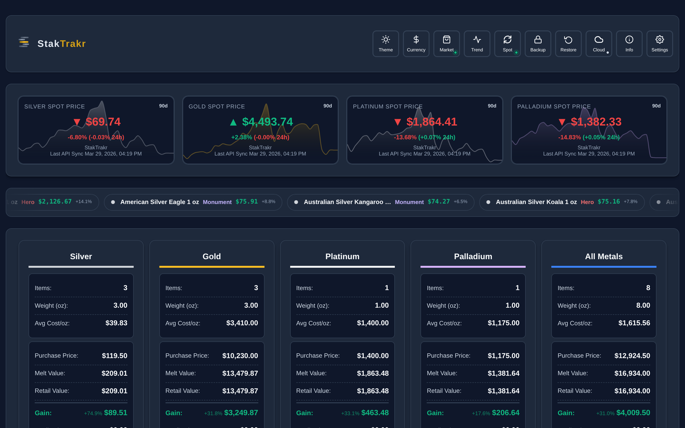
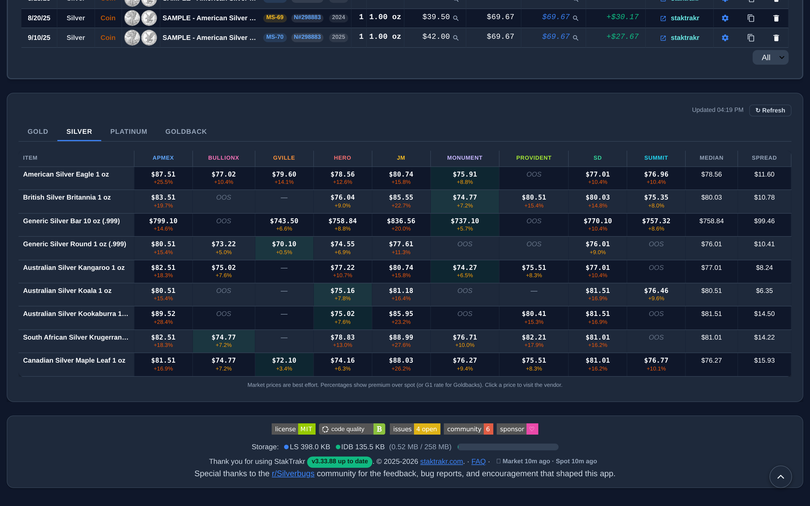
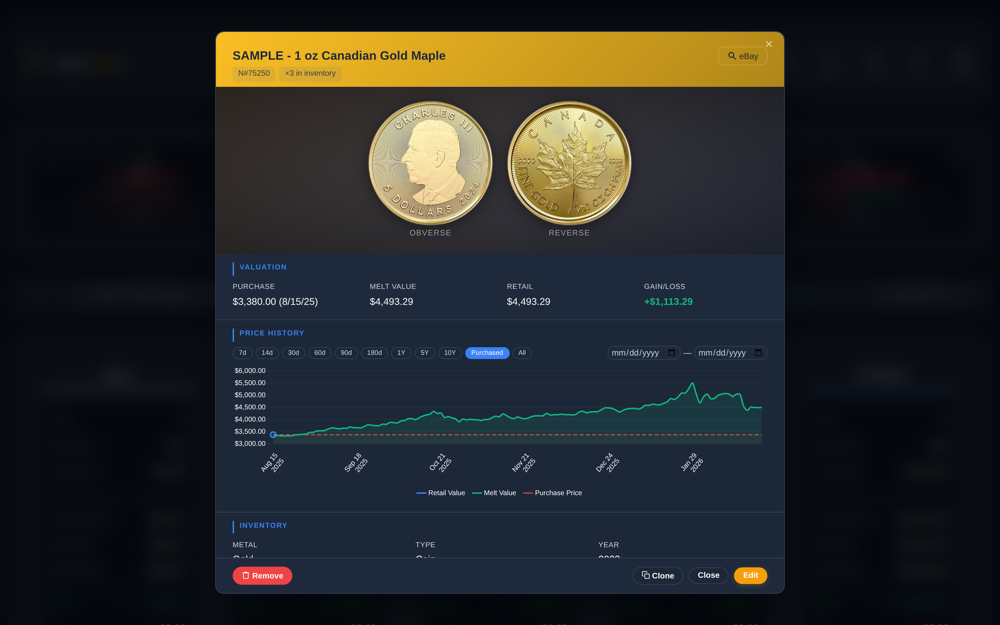
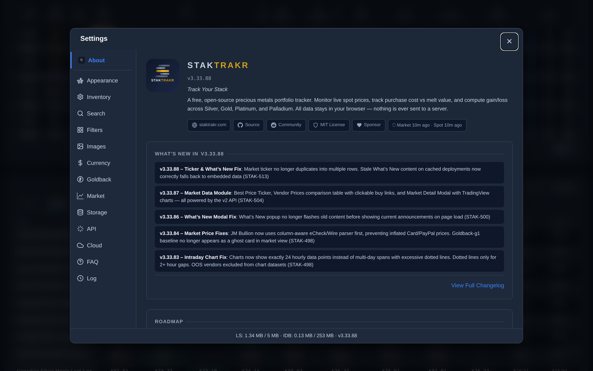
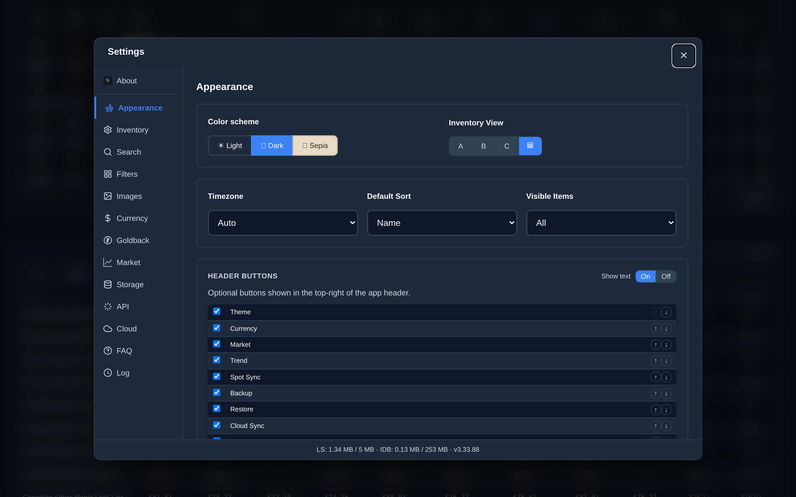
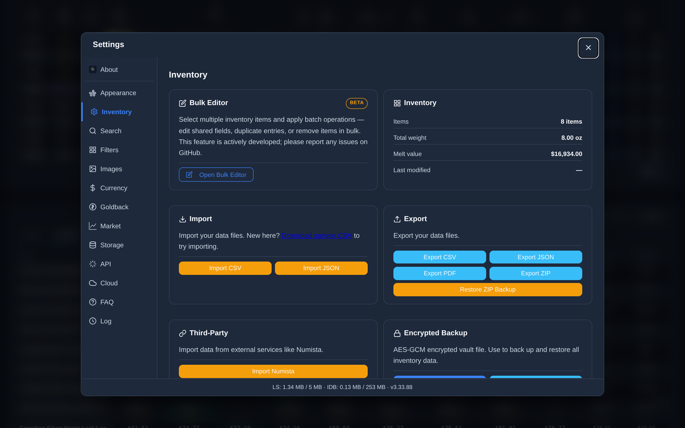

<h1 align="center">
  
</h1>

  Track your precious metals stack. Your way.

  
  
  
  
  

  <a href="https://www.staktrakr.com"><strong>Launch App</strong></a> &bull;
  <a href="https://beta.staktrakr.com">Beta</a> &bull;
  <a href="https://lbruton.github.io/StakTrakr/about.html">About</a> &bull;
  <a href="CHANGELOG.md">Changelog</a>

---

A powerful, privacy-first portfolio tracker for Silver, Gold, Platinum, Palladium, and Goldbacks. Runs entirely in your browser — your stack, your data, your rules.

| Vendor Price Matrix                                | Item View Modal                                  |
| -------------------------------------------------- | ------------------------------------------------ |
|  |  |

| Settings — About                                     | Appearance                                                     | Inventory                                                    |
| ---------------------------------------------------- | -------------------------------------------------------------- | ------------------------------------------------------------ |
|  |  |  |

---

## What's New in v3.35.64

- **Retail price reliability** — Summit Metals prices restored after a related-products carousel false-flagged the whole vendor out of stock; goldback's stale-data warning now fires correctly during feed outages instead of silently showing hours-old prices (STRK-251, STRK-250)
- **Goldback intraday pricing** — new hourly price feed covering the last 72 hours, honest scrape-time timestamps instead of a daily placeholder, and a 2-hour freshness budget (STRK-248)
- **Realtime price freshness** — spot, goldback, and retail prices load fresh on every visit instead of a stale cached copy, with automatic failover to the backup API (STRK-249)
- **Constitutional (junk) silver** — lot pricing by denomination, bulk Type→Goldback conversion, custom-purity field reset on type changes, and value-chart history capture for valuation-only edits (STRK-242, STRK-244, STRK-245, STRK-246, STRK-247)

Full details in the [Changelog](CHANGELOG.md).

---

## Why StakTrakr?

Most precious metals apps want your email, store your data on their servers, or lock features behind a paywall. StakTrakr is different:

- **100% client-side** — all data lives in your browser. The full source is open; it even runs on `file://` from a single HTML file.
- **Zero data collection** — no account, no email, no profile. Nothing leaves your device unless you explicitly cloud-backup.
- **Works offline** — once loaded, the app runs without internet (spot prices require connectivity).
- **Portable & free** — download the ZIP, open `index.html`, runs anywhere, forever. MIT licensed.

Optional [sponsorships](https://github.com/sponsors/lbruton) keep the free API infrastructure running.

---

## Features

### Pricing — Spot & Market

Real-time prices from multiple providers with automatic failover. The free, keyless `api.staktrakr.com` works out of the box; add Metals.dev, MetalPriceAPI, GoldAPI, or a custom URL for higher-frequency updates. Manual mode supports fully offline pricing. Sparkline charts with 7d/30d/60d/90d range selector, health indicators, and years of seed history (1968–present) baked in.

For retail, a **Best Price Ticker** highlights the cheapest vendor per coin with direct buy links. The **Vendor Prices Matrix** compares Gold, Silver, Platinum, Palladium, and Goldbacks across major bullion dealers with premium badges and clickable product-page links. Click any coin to see a **TradingView chart** overlaying spot history with per-vendor price lines.

### Portfolio Tracking

Rich per-item data model: Purchase Price / Melt / Retail with computed Gain/Loss (per item and portfolio-wide); realized gains/losses via Sold / Traded / Lost / Gifted / Returned dispositions with full transaction history; lot ⇄ each purchase toggle; troy ounces / kilograms / pounds with auto-conversion; year, grade, grading authority, cert # for graded coins; serial numbers for bars and notes; per-item notes, photos (your own or Numista CDN), price history, and storage location. Goldback and Silverback support with denomination-aware pricing.

### Browse — Cards, Table, Filters, Tags

Four card styles (sparkline header, full-bleed image, split layout, accessible table) plus a sortable table view with thumbnails and inline chip badges. **Smart filter chips** auto-generate from your collection across 10 configurable categories (Metal, Type, Name, Year, Grade, Numista ID, Source, Storage, etc.) with custom grouping rules, save-search-as-chip, and right-click blacklist. **Tags** — both Numista-synced (Bullion, Proof, Commemorative) and your own — integrate with filters and global rename/delete.

### Catalog — Numista & PCGS

**Numista** search by name, country, or catalog number; bulk metadata + CDN image sync with progress log; regex pattern rules for auto-matching catalog IDs to your item names. **PCGS** lookup by number with form auto-fill; cert verification badges link directly to PCGS/NGC. Per-field origin tracking shows whether each field came from Numista, PCGS, CSV import, or manual entry — and powers a two-tier re-sync picker with smart defaults. The **Item View Modal** combines price history charts (melt + retail, 1Y/5Y/10Y/Purchased/custom range), Numista metadata, tags, certification badge, and disposition history.

### Cloud Sync — Encrypted, Zero-Knowledge

Connect Dropbox via OAuth PKCE and sync an encrypted `.stvault` across devices. AES-256-GCM + PBKDF2-SHA256 (600,000 iterations) via the Web Crypto API — the cloud provider only ever receives ciphertext. Bi-directional sync with conflict detection; a **DiffModal** for visual item-level and settings-level review with click-to-pick field selection; encrypted image vault for photo sync; BroadcastChannel leader election prevents concurrent multi-tab races; multi-account switching; backup-before-overwrite with configurable history depth. Google Drive, OneDrive, pCloud, and Box are coming (same encryption, all client-side).

### Data Tools — Import, Export, Backup, Bulk Edit

CSV import with intelligent field mapping, regex custom rules, and merge/override modes (DiffModal preview). Export as CSV, JSON, PDF, or full ZIP backup. Encrypted `.stvault` exports with password strength meter. Spot history import/export between instances. Inline clone with Save & Clone Another; full-screen **Bulk Edit** in Settings → Inventory with searchable checkbox table, 16 fields editable at once, bulk copy/delete, and Numista Lookup populating fields from catalog data.

### Settings & Quality of Life

Everything in one place with sidebar navigation:

| Tab            | What's Here                                                                                             |
| -------------- | ------------------------------------------------------------------------------------------------------- |
| **About**      | Version info, API status badge, What's New, badges, changelog, force refresh                            |
| **Appearance** | Theme (Light / Dark / Slate / Sepia), header button visibility and reorder, layout section toggles      |
| **Inventory**  | Card styles (A/B/C/D), default sort, visible rows, import/export/backup controls, bulk edit, data reset |
| **Filters**    | Category toggles, sort order, grouping rules, blacklist, max chip count, search behavior                |
| **Images**     | Image cache management, upload settings, bulk image sync                                                |
| **Currency**   | Display currency (17 currencies), exchange rates, Goldback pricing controls                             |
| **Market**     | Market data toggles, vendor display preferences                                                         |
| **Storage**    | localStorage and IndexedDB usage dashboard                                                              |
| **API**        | Spot price source selection, Numista and PCGS catalog integration, usage tracking                       |
| **Cloud**      | Dropbox connection, cloud backup/restore, sync history, multi-account management                        |
| **Log**        | Activity Log — full change history with undo/redo                                                       |
| **FAQ**        | Privacy, backup, security, and limitations — built into the app                                         |

Also: PWA install, 17-currency support with live exchange rates, fuzzy search across all fields, shift+click / long-press inline editing, timezone-aware display, three-state disposed filter, and environment badges (BETA / PREVIEW / LOCAL) on non-production domains.

---

## Getting Started

Open [www.staktrakr.com](https://www.staktrakr.com) for the hosted version, or download a release ZIP, extract, and open `index.html` in any modern browser — no server required. For local development, `python3 -m http.server 8000` works fine. StakTrakr ships with sample inventory and years of spot history so every feature is explorable on first launch; sample items are clearly labeled.

Two optional integrations enhance the experience: a free [Numista API](https://en.numista.com/api/) key enables catalog search, image population, and metadata sync; a free [PCGS API](https://www.pcgs.com/coinfacts) key enables PCGS lookup and cert verification. Both are configured in Settings → API.

---

## Data & Privacy

- **No server-side component** — the developer has no technical means to access your data.
- **No cookies, no tracking SDKs, no advertising** — only localStorage and IndexedDB are used for your data.
- **Cloud backup is zero-knowledge** — AES-256-GCM + PBKDF2-SHA256 (600,000 iterations); the cloud provider receives only ciphertext.
- **localStorage caveat** — browser storage can be cleared. Export ZIP or vault backups regularly, especially on iOS Safari.
- Cloudflare Web Analytics runs on the hosted site (aggregated, anonymous page-views only — not present when running locally).

Full details in the [Privacy Policy](https://www.staktrakr.com/privacy.html) and the FAQ tab in Settings.

---

## Tech Stack

| Layer            | Technology                                                                      |
| ---------------- | ------------------------------------------------------------------------------- |
| Runtime          | Pure client-side JavaScript (no framework, no build step)                       |
| Storage          | Browser localStorage + IndexedDB                                                |
| Encryption       | Web Crypto API — AES-256-GCM via PBKDF2                                         |
| Styling          | Vanilla CSS with CSS custom properties (oklch token system), four themes        |
| Charts           | Chart.js 3.9.1 + TradingView Lightweight Charts                                 |
| CSV / PDF / ZIP  | PapaParse 5.4.1, jsPDF 2.5.1 + AutoTable 3.5.25, JSZip 3.10.1                   |
| Hosting          | Cloudflare Pages                                                                |
| Spot API         | api.staktrakr.com (free, keyless) + Metals.dev, MetalPriceAPI, GoldAPI, others  |
| Market API       | api.staktrakr.com v2 (free, keyless) — retail prices from major bullion dealers |
| Catalog          | Numista API, PCGS CoinFacts                                                     |
| Exchange Rates   | Open Exchange Rates                                                             |
| Security tooling | Codacy (A+), CodeQL, Semgrep, PMD, ESLint                                       |

---

## Contributing

Bug reports and pull requests are welcome — please open an [issue](https://github.com/lbruton/StakTrakr/issues) first to discuss significant changes. The app must remain a **zero-install, single-page, vanilla JS** application: no build step, no framework, runs on `file://`. Development tooling lives in `devops/`.

## License

MIT License. See [LICENSE](LICENSE).

## Community

- Reddit: [r/staktrakr](https://www.reddit.com/r/staktrakr/)
- Issues: [GitHub Issues](https://github.com/lbruton/StakTrakr/issues)
- Sponsor: [GitHub Sponsors](https://github.com/sponsors/lbruton)
